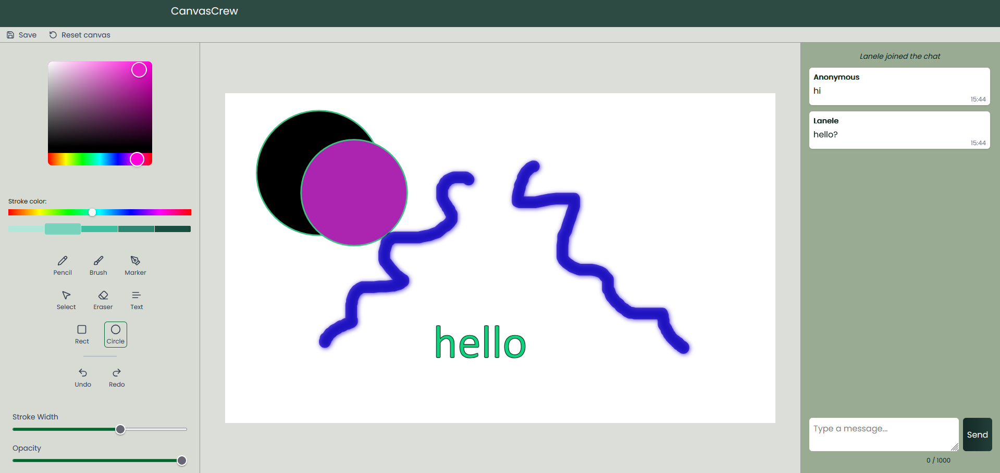
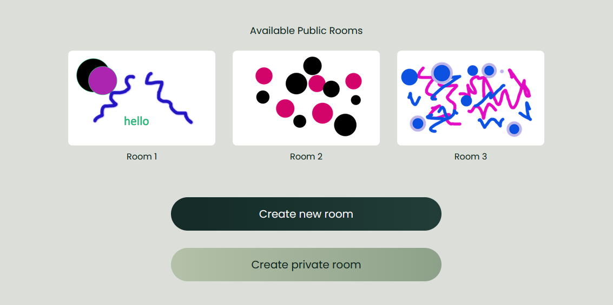

# 🎨 Canvas Crew

Multiplayer drawing app with shared canvas and chat.

## 🔗 Links

* 🌐 App: https://canvas-crew.vercel.app

## ✨ Features

* Real-time drawing and chat using WebSockets (Socket.IO)
* Public and private rooms
* Shared canvas inside each room
* Drawing tools: brush, pencil, marker, eraser, shapes, text
* Draggable elements (layer-based)
* Undo / redo
* Raster-based eraser with pixel-level subtraction
* Zoomable workspace with mouse wheel scaling
* Customizable styles: color palette, stroke, opacity, and line width 

## ⚙️ Tech Stack

**Frontend**

* React (TypeScript)
* Zustand
* Tailwind CSS
* Konva (canvas)
* Socket.IO

**Backend**

* Node.js + Express
* Socket.IO
* In-memory state (room-based)

**Deployment**

* Vercel (frontend)
* Fly.io (backend)

## 🚀 Run locally

```bash
git clone https://github.com/Flanele/canvas_crew.git
cd canwas_crew
npm install
cd server && npm install
cd ../client && npm install
cd ..
npm run dev
```

## 📸 Preview



